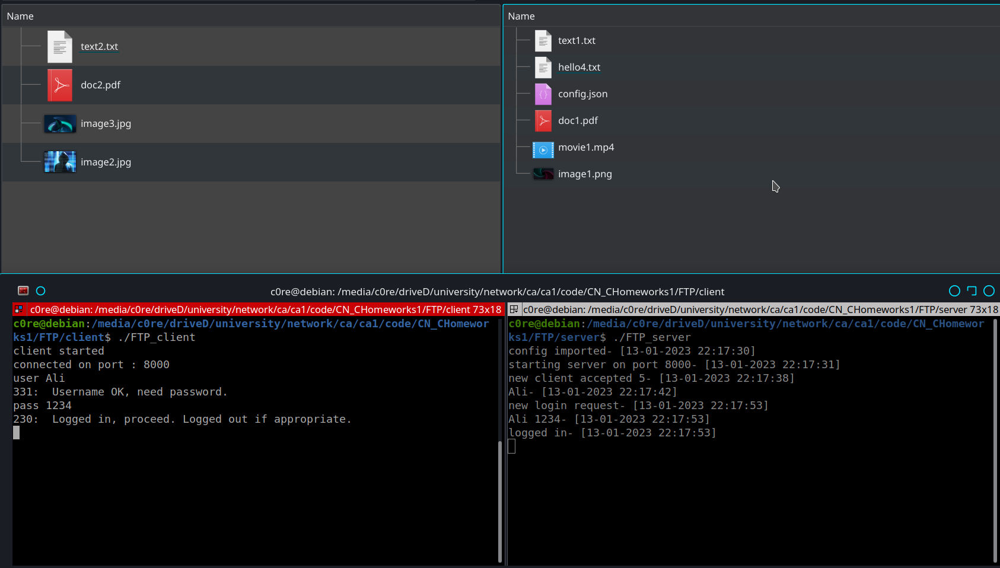
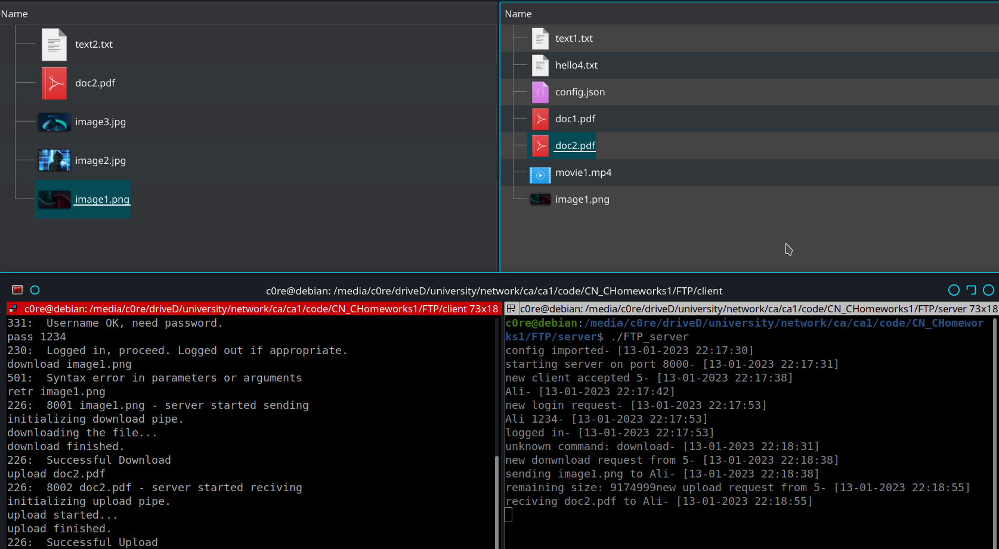
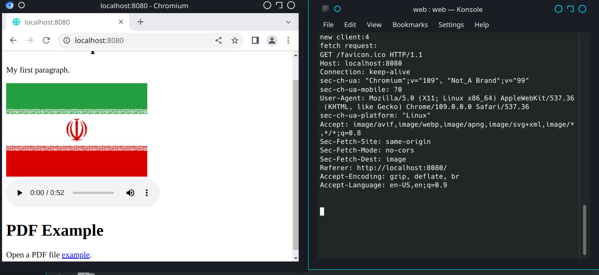
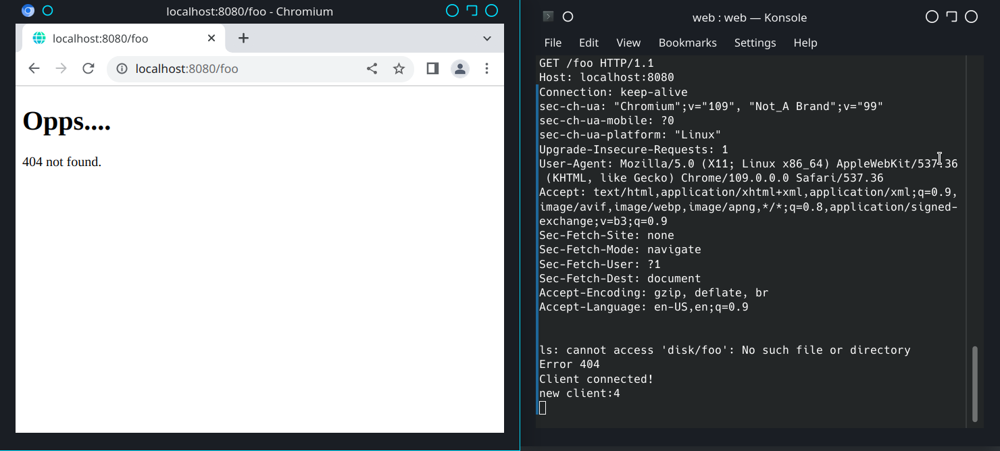

# CN Homework 1

## In the Name of GOD

## introduction

This project has three parts:

- FTP: Simplified FTP server and client. They can transfer files by the means of unix socket.

- HTTP Web Server: A web server that listen to a special port. Then browser can connect to it and load predifined HTML pages.

- Chat : Here we have one server and multiple client. Client and Server should communicate each other by a predefined message format. 

> Note that this file contains a overview of the project and code document is available at [docs/html/index.html](docs/html/index.html) .

## Building

You can build the whole project by running `build.sh` script:

```bash
bash build.sh
```

It's also possible to clean build output by `clean.sh` :

```bash
bash clean.sh
```

## Running programs

for running of each program you should set current directory then run the output file.

### FTP

- server : 
  ```bash
  cd FTP/server/
  ./FTP_server
  ```

- client : 
  ```bash
  cd FTP/client/
  ./FTP_client
  ```


### HTTP Web server

```bash
cd web
./web
```

## Directories Description

```bash
├── common # common source files between programs. Often contains utility functions. e.g. `isFileExist` function that is common between FTP server and HTTP server.
│   └── include
│       └── nlohmann # json library include path
├── docs # documents generated by doxygen
│   └── html
│       └── search
├── FTP # FTP project
│   ├── client # FTP client source file
│   │   └── clients_disk # FTP client download directory
│   └── server # FTP server source file
│       └── server_disk # # FTP server files
└── web # HTTP web server source file
    └── disk # directory of storing static files e.g. 404.html

```

## Running reports

a sample functionality of each program has been showed here.

### FTP

At first we login by a client:



then we download i`mage1.png` and upload `doc2.pdf`:



## HTTP web server

The result of main html page:


The result of incorrect url:


## End Notes

We have used [nlohmann json library](https://github.com/nlohmann/json) in this project.  
